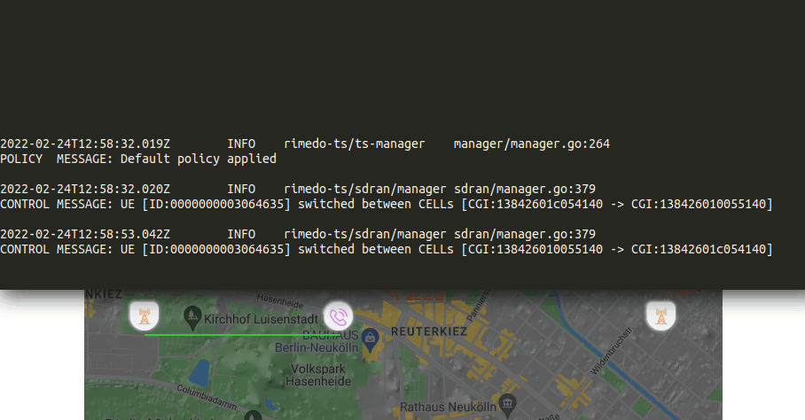
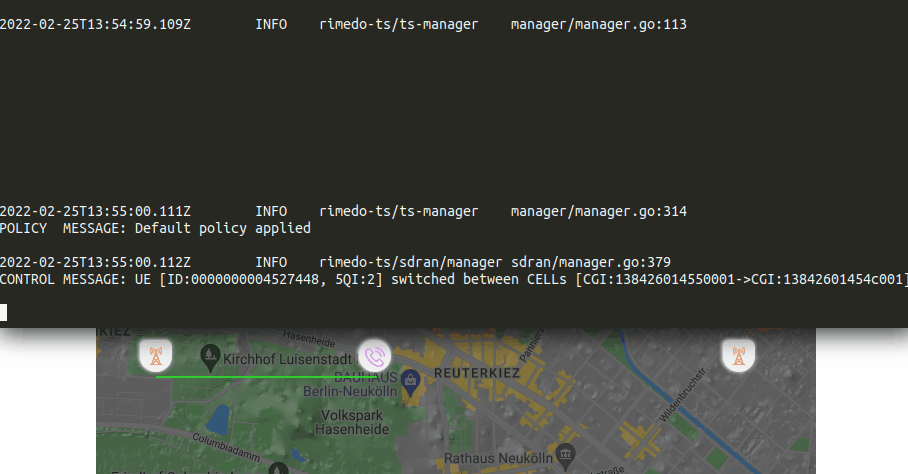
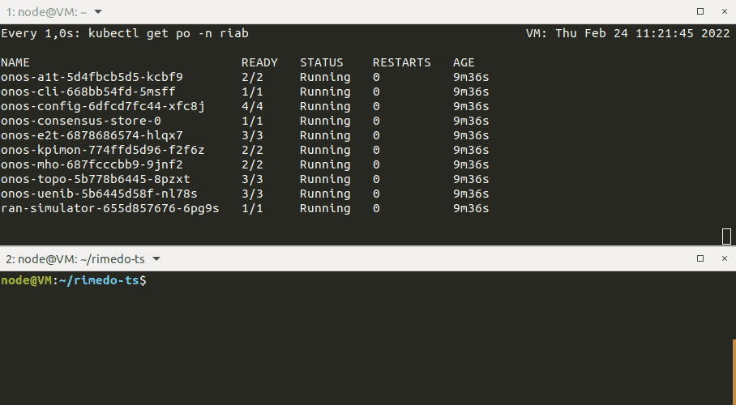

<!--
SPDX-FileCopyrightText: 2019-present Open Networking Foundation <info@opennetworking.org>
SPDX-FileCopyrightText: 2019-present Rimedo Labs

SPDX-License-Identifier: Apache-2.0
-->

<p align="center"></p>

<p align="center">
    <a href="https://www.rimedolabs.com/"></a> &nbsp;
    <a href="https://www.linkedin.com/company/rimedolabs"></a> &nbsp;
    <a href="https://www.rimedolabs.com/blog/"></a>
</p>

<p align="center">
  <a href="https://img.shields.io/github/v/tag/onosproject/rimedo-ts?style=for-the-badge"></a>
</p>

## Overview

Traffic Steering (TS) xApplication (xApp) for µONOS RIC - associates the users with the eNB/gNB taking into account user radio conditions, cell types, and service type/QoS profile. It can be controlled by policies from non-RT RIC (A1 interface).

### Key features:
- Suitable for heterogeneous scenarios
- Per-user association decision taking into account radio conditions (e.g. RSRP), service type (e.g. 5QI), cell type
- Optimizes user-throughput and cell-outage

## An example of xApp operation
Example of an policy influence on single UE. The traffic sterring is realized by direct indication of user as the policy scope contains `ueId`. It is worth paying attention to UE association at different point of time. 


#### List of events during the demo:

<details><summary><b>12:58:32</b> - start of xApp</summary>
    
```sh
there is no TS policy applied
```
    
</details>

<details><summary><b>13:00:00</b> - put policy with ID 1 to A1T endpoint</summary>

```json
{
   "scope":{
      "ueId":"0000000003064635"
   },
   "tspResources":[
      {
         "cellIdList":[
            {
               "plmnId":{
                  "mcc":"314",
                  "mnc":"628"
               },
               "cId":{
                  "ncI":470106432
               }
            }
         ],
         "preference":"PREFER"
      }
   ]
}
```
    
</details>

<details><summary><b>13:01:47</b> - delete policy with ID 1 at A1T endpoint</summary>
    
```sh
there is no TS policy applied
```
   
</details>

<details><summary><b>13:02:47</b> - put policy with ID 2 at A1T endpoint</summary>
    
```json
{
   "scope":{
      "ueId":"0000000003064635"
   },
   "tspResources":[
      {
         "cellIdList":[
            {
               "plmnId":{
                  "mcc":"314",
                  "mnc":"628"
               },
               "cId":{
                  "ncI":470106432
               }
            }
         ],
         "preference":"AVOID"
      }
   ]
}
```
    
</details>

<details><summary><b>13:04:07</b> - put policy with ID 2 at A1T endpoint (<i>update</i>)</summary>
  
```json
{
   "scope":{
      "ueId":"0000000003064635"
   },
   "tspResources":[
      {
         "cellIdList":[
            {
               "plmnId":{
                  "mcc":"314",
                  "mnc":"628"
               },
               "cId":{
                  "ncI":470106432
               }
            }
         ],
         "preference":"FORBID"
      }
   ]
}
```
    
</details>

<details><summary><b>13:05:07</b> - delete policy with ID 2 at A1T endpoint</summary>
    
```sh
there is no TS policy applied
```
   
</details>

## Extra example of xApp operation
<details><summary>Click to show demo</summary><br>
  
Example of an policy influence on single UE or group of UEs. The traffic sterring is realized by indication of user's service type as the policy scope contains `qosId` - in this case `5qI` value is used. It is assumed that only one slice exists. The values of 5QI are changing randomly according to the data generated by the simulator. It is worth paying attention to UE association at different point of time. 



#### List of events during the demo:
    
<details><summary><b>13:55:00</b> - start of xApp</summary>
        
```sh
there is no TS policy applied
```
</details>
    
<details><summary><b>13:56:23</b> - put policy with ID 1 to A1T endpoint</summary>  

```json
{
   "scope":{
      "sliceId":{
         "sst":1,
         "sd":"456DEF",
         "plmnId":{
            "mcc":"314",
            "mnc":"628"
         }
      },
      "qosId":{
         "5qI":1
      }
   },
   "tspResources":[
      {
         "cellIdList":[
            {
               "plmnId":{
                  "mcc":"314",
                  "mnc":"628"
               },
               "cId":{
                  "ncI":470106432
               }
            }
         ],
         "preference":"SHALL"
      }
   ]
}
```
    
</details>
</details>
    
## Installation 
To use TS xApp there should be kubernetes, docker, helm and sdran (by ONOS) installed and deployed. You can use [SDRAN-in-a-Box](https://github.com/onosproject/sdran-in-a-box) project to install everything at once, or install requirements manually and deploy *sdran* from [SDRAN Helm charts](https://github.com/onosproject/sdran-helm-charts) repository.

### Requirements
TS xApp was tested under this version of SD-RAN modules. Tested under ran-simulator model `two-cell-two-node-model.yaml`.

| Module        | Version       | 
| ------------- |--------------:| 
| onos-a1t      | v0.1.11       | 
| onos-cli      | v0.9.10       | 
| onos-config   | v0.10.27      | 
| onos-e2t      | v0.10.11      | 
| onos-topo     | v0.9.2        | 
| ran-simulator | v0.9.6        | 
| e2sm_mho_go   | v0.8.7        |

### Deployment

To deploy TS xApp firstly build docker image, and then use helm to install xApp.

```bash
    make docker
    make install-xapp
```



### Useful tips
    
- `<ip_address>:31963/policytypes/ORAN_TrafficSteeringPreference_2.0.0/policies/<policy_id>` - the policies are send to `A1` interface on address
- `kubectl logs -n riab rimedo-ts-<id> rimedo-ts` - observe logs of TS xApp
- `watch onos uenib get ues -v` - observe RSRP of UE (type in `onos-cli`)
